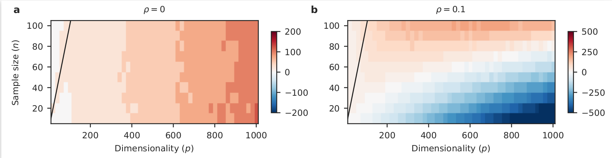

# The optimal ridge penalty for real-world high-dimensional data can be zero or negative due to the implicit ridge regularization
Dmitry Kobak, Jonathan Lomond, Benoit Sanchez  
https://arxiv.org/abs/1805.10939  
*Journal of Machine Learning*, in press

The entire code is contained within the single Python notebook.
